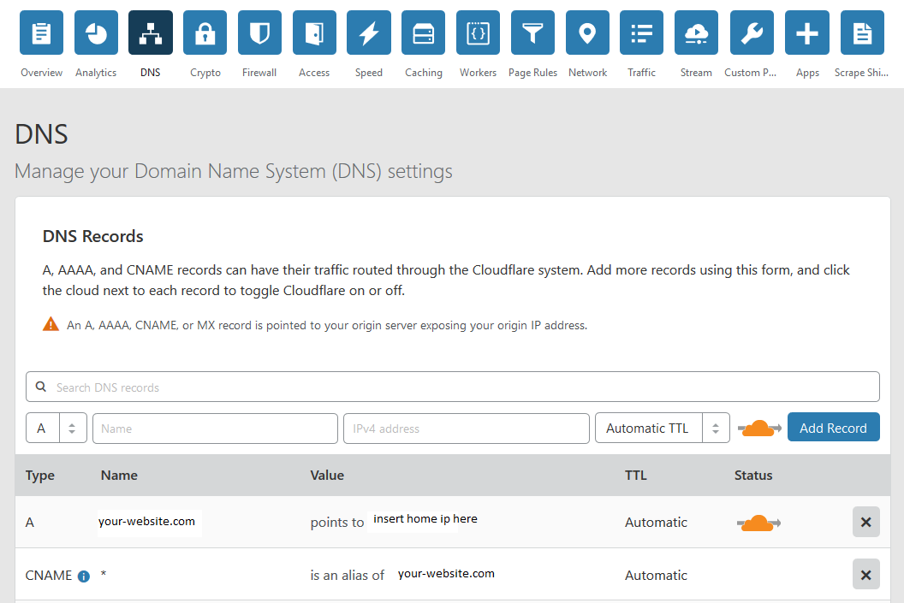

# Homelab Setup

This guide is very much a constant work in progress, more for my own sake so I don't forget how I set all of this up. I'm trying to document the various pitfalls I experienced, but I have no doubt that there are quite a few that slipped through. I started out running Pihole on a Raspberry Pi, but then I wanted to use Home Assistant to start automating things around my house, and then I needed to use Traefik to access it when I wasn't home and then suddenly the little Pi couldn't keep up. Currently everything is running on an old laptop with 16gb of RAM running Xubuntu 18.04.

These are all the containers I have running at home. Everything is run behind a Traefik reverse proxy, with SSL certificates.

Currently, I'm running:

* [Traefik](#traefik)
* [Home Assistant](#home-assistant)
* [PiHole](#pihole)
* [Organizr](#organizr)
* [Portainer](#portainer)
* [Mosquitto](#mosquitto)
* [MongoDB](#mongodb)
* [InfluxDB](#influxdb)
* [Grafana](#grafana)
* [Chronograf](#chronograf)
* [Node-RED](#node-red)
* [MQTTBridge](#mqtt-bridge) (to make Samsung SmartThings post to MQTT topics)
* [Fail2Ban](#fail2ban)
* [Nextcloud](#nextlcoud)
* [MariaDB](#mariadb)
* [PHPMyAdmin](#phpmyadmin)
* [Watchtower](#watchtower)
* [Duplicati](#duplicati) (easiest backup solution I've found)

as containers, and my server has a [Samba](#samba) share set up to eventually allow access to media stored elsewhere on my network. I've configured my persistent container data to be shared, allowing me to edit config files from the comfort of my desktop without needing to SSH in, and having Samba set up is useful for Duplicati backups.

As far as devices, I'm using:

* Hue bulbs
* Amazon Echo/Echo Dot
* TP-Link Wifi Smart Plugs
* Samsung SmartThings
  * Hub
  * Contact Sensors
  * Outlets
  * Motion Detectors
* Sylvania ZigBee Outlets
* Yi Home Cams
* Assorted Raspberry Pi models 2 and 3 - some with temperature and light sensors, one as a wall-mounted touchscreen to act as a control panel for Home Assistant
* Samsung Galaxy Tab S - also a wall-mounted control panel, also has a few sensors I use
* Roku
* Chromecast
* Router running DD-WRT
* Nest Thermostat

The SmartThings hub only seems to work when the phase of the moon is just right, and if I had to do it over, I would go with a different platform.

I'm in the process of adding a Pi running OctoPrint (for controlling my 3D printer), a few ESP8266's that will post sensor data to an MQTT topic, some repurposed Amazon dash buttons, and a ton of NFC tags I'm trying to find uses for.

## Docker Setup

If you don't have Docker installed, follow the instuctions [here](https://docs.docker.com/install/linux/docker-ce/ubuntu/).

Having a specific Docker group is useful so you don't have to `sudo` everything, so after installation run

`sudo groupadd docker`  
`sudo usermod -aG docker $USER`

Then log out and back in. If you can `docker run hello-world` without needing `sudo`, you're good to go. If you still get permissions errors try  

`sudo chown "$USER":"$USER" /home/"$USER"/.docker -R`  
`sudo chmod g+rwx "$HOME/.docker" -R`  

Next, configure Docker to run on start up:  

`sudo systemctl enable docker`

Now install docker-compose:

`sudo curl -L "https://github.com/docker/compose/releases/download/1.23.2/docker-compose-$(uname -s)-$(uname -m)" -o /usr/local/bin/docker-compose`

modifying the version number to whatever is most recent. Next, create a docker network:

`docker network create traefik_proxy`

Then create a file, `.env`, which will store all the things you'd like to keep secret.

>PUID=  
PGID=  
TZ=  
USERDIR=   
MYSQL_ROOT_PASSWORD=  
MYSQL_PASSWORD=  
MYSQL_USER=  
MYSQL_DATABASE=  
HTTP_USERNAME=  
HTTP_PASSWORD=  
DOMAINNAME=  
CLOUDFLARE_EMAIL=  
CLOUDFLARE_API_KEY=  
PIHOLE_PASSWORD=  
LOCAL_IP=  
BACKUPPC_ADMIN_USER=  
BACKUPPC_ADMIN_PASS=  

`PUID` and `PGID` can be found on your system by running `id $user`.  
`TZ` is your current time zone  
`USERDIR` is the root directory where you could like your persistent container data stored. For me it's something like `/home/me/containers`  
`DOMAINNAME` is self-explanatory - `my-website.com` or whatever it is you own.  
`LOCALIP` is the local network address of your server.  

The rest of them can wait for now.

Cloudflare was by far the easiest to integrate with Traefik (and use wildcard certificates for subdomains) between the various DNS servers I tried - NameCheap, Google Domains, and Amazon - and this guide assumes that's what you're using.

Create a file, `docker-compose.yml` in the USERDIR you defined earlier. At the top of the file, with no indentation, add:

    version: '3'
    services:

I keep my networks defined at the bottom of the file like so:

    networks:  
      traefik_proxy:  
        external:  
          name: traefik_proxy
      default:
        driver: bridge

In between the `services` and the `networks` we'll define how our containers will be set up. First though, get Cloudlfare set up.

## Create .htpasswd

Traefik doesn't have any protection for the API or dashboard we're going to expose, so we need to take care of that first by creating a file called .htpasswd that contains a login name in plaintext, and the hash of a password. In this guide, I placed the file under my `${USERDIR}/shared/` directory. Open a terminal in that folder and type

`htpasswd -c .htpasswd username`

where `username` is whatever you want your login name to be. It'll prompt you for a password, and then create the file. When you login, you will use the password, not the hash, so don't lose it. Fill in the `HTTP_USERNAME` and `HTTP_PASSWORD` variables in your `.env` file with the values from `.htpasswd`.

## Configure Cloudflare

I don't have a need for dynamic DNS, so this guide won't cover it, but it is relatively easy to set up with Cloudflare

You'll need your Global API key, so grab that and save it in your `.env` file.

You will eventually need to forward ports `80` and `443` to the local IP of your server, but that can wait until we have Traefik up an running.

## Traefik

Add this as a service to your `docker-compose.yml` file.

      traefik:
        hostname: traefik
        image: traefik:latest
        container_name: traefik
        restart: always
        volumes:
          - /var/run/docker.sock:/var/run/docker.sock:ro
          # create these toml files first
          - ${USERDIR}/traefik/traefik.toml:/etc/traefik/traefik.toml:ro
          - ${USERDIR}/traefik/rules.toml:/etc/traefik/rules.toml:ro
          - ${USERDIR}/traefik/acme:/etc/traefik/acme
          - ${USERDIR}/shared:/shared
          - ${USERDIR}/traefik/log:/var/log
        ports:
        - "80:80"
        - "443:443"
        - "8090:8080"
        networks:
          - default
          - traefik_proxy
        environment:
          - CLOUDFLARE_EMAIL=${CLOUDFLARE_EMAIL}
          - CLOUDFLARE_API_KEY=${CLOUDFLARE_API_KEY}
        command:
          - --web
          - --accessLog.filePath=/var/log/access.log
          - --accessLog.filters.statusCodes=400-499
        labels:
          - "traefik.enable=false"

At the top, we have

      traefik:
        hostname: traefik
        image: traefik:latest
        container_name: traefik
        restart: always

`image: traefik:latest` tells Docker to pull the image tagged with `latest` from `hub.docker.com`. Other hubs are available, as are other image versions - often, `latest` is a beta, or something not entirely suited for production. Feel free to leave the tag off. The `container_name` can be whatever you want, but for simplicity (since I am only running one of each), I usually keep it the same name as the service. The `restart` setting gives you a few different options: `unless-stopped`, `no`, `always`, and `on-failure`.

Next,

        volumes:
          - /var/run/docker.sock:/var/run/docker.sock:ro
          # create these toml files first
          - ${USERDIR}/traefik/traefik.toml:/etc/traefik/traefik.toml:ro
          - ${USERDIR}/traefik/rules.toml:/etc/traefik/rules.toml:ro
          - ${USERDIR}/traefik/acme:/etc/traefik/acme
          - ${USERDIR}/shared:/shared
          - ${USERDIR}/traefik/log:/var/log

tells Docker where the persistent data for the container will live. The best thing about Docker is that you can easily switch between versions of something by simply using a different image. If you're on version 1.1 of something, and 1.2 comes out, just pull the new image and throw away the old container. Your settings won't go anywhere. It helps to think of each container as a tiny little virtual machine, running only what it needs. We can map folders from there to the host machine, allowing us to persist configuration files and things like that. Everything that isn't mapped will disappear when the container is removed.  

The line `- /var/run/docker.sock:/var/run/docker.sock:ro` gives the container access to the host machine's UNIX socket, in read-only mode. Essentially this allows the container to exchange data between other processes on the host. Not needed for every container.

The next few lines allow us to keep our config and log files. Docker, by default, will create directories that don't exist already - in fact, it creates everything as a directory, even things that are supposed to be files. You'll need to change directories to you container root, then

`mkdir traefik`  
`mkdir traefik/acme`

followed by  

`touch traefik/traefik.toml && touch traefik/rules.toml && touch traefik/acme/acme.json`  

to create the files.

The next section,

        ports:
        - "80:80"
        - "443:443"
        - "8090:8080"

maps our access ports. `HostPort:ContainerPort` is the schema, so to access the port the container sees as `8080`, I type in `localhost:8090` in the host machine. For most containers, the host ports are arbitrary - except Traefik needs `80` and `443`, and PiHole will need `53`.  

Docker keeps containers fairly isolated from each other by default, so this section

        networks:
          - default
          - traefik_proxy

tells Docker to have this container join the network we created earlier.

This

        environment:
          - CLOUDFLARE_EMAIL=${CLOUDFLARE_EMAIL}
          - CLOUDFLARE_API_KEY=${CLOUDFLARE_API_KEY}

allows us to pass some default options into the container on startup, using variables defined in the `.env` file.

This

        command:
          - --web
          - --accessLog.filePath=/var/log/access.log
          - --accessLog.filters.statusCodes=400-499

overrides a few defaults, and tells the container to log certain status codes, which we will need when we set up Fail2Ban.

The labels section,

        labels:
          - "traefik.enable=true"
          - "traefik.backend=traefik"
          - "traefik.frontend.rule=Host:traefik.${DOMAINNAME}"  
          #- "traefik.frontend.rule=Host:${DOMAINNAME}; PathPrefixStrip: /traefik"
          - "traefik.port=8080"
          - "traefik.docker.network=traefik_proxy"
          - "traefik.frontend.headers.SSLRedirect=true"
          - "traefik.frontend.headers.STSSeconds=315360000"
          - "traefik.frontend.headers.browserXSSFilter=true"
          - "traefik.frontend.headers.contentTypeNosniff=true"
          - "traefik.frontend.headers.forceSTSHeader=true"
          - "traefik.frontend.headers.SSLHost=${DOMAINNAME}.com"
          - "traefik.frontend.headers.STSIncludeSubdomains=true"
          - "traefik.frontend.headers.STSPreload=true"
          - "traefik.frontend.headers.frameDeny=true"

is where Traefik works its magic.

First, we enable Traefik for this container.  

          - "traefik.enable=true"

Then, tell Traefik the name of the backend container

          - "traefik.backend=traefik"

Now, here is the subdomain you would like to use, so if you go to traefik.your-website.com, Traefik will look for that request and direct you to the appropriate container

          - "traefik.frontend.rule=Host:traefik.${DOMAINNAME}"  

If you are not using subdomains, and instead using a path, like your-website.com/traefik, then comment out the line above and uncomment this one.

          #- "traefik.frontend.rule=Host:${DOMAINNAME}; PathPrefixStrip: /traefik"

These next lines tell Traefik what internal port to use, what network the container is on, and then the rest are enough security headers to get an A+ rating from [SSLLabs](https://ssllabs.com)

          - "traefik.port=8080"
          - "traefik.docker.network=traefik_proxy"
          - "traefik.frontend.headers.SSLRedirect=true"
          - "traefik.frontend.headers.STSSeconds=315360000"
          - "traefik.frontend.headers.browserXSSFilter=true"
          - "traefik.frontend.headers.contentTypeNosniff=true"
          - "traefik.frontend.headers.forceSTSHeader=true"
          - "traefik.frontend.headers.SSLHost=${DOMAINNAME}.com"
          - "traefik.frontend.headers.STSIncludeSubdomains=true"
          - "traefik.frontend.headers.STSPreload=true"
          - "traefik.frontend.headers.frameDeny=true"

Now we can edit the `traefik.toml` file you created earlier.

### Traefik Configuration

    #debug = true

    logLevel = "ERROR" #DEBUG, INFO, WARN, ERROR, FATAL, PANIC
    InsecureSkipVerify = true
    defaultEntryPoints = ["https", "http"]

    # web interface
    [api]
      entryPoint = "traefik"
      dashboard = true

    # Force HTTPS
    [entryPoints]
      [entryPoints.http]
        address = ":80"
        [entryPoints.http.redirect]
        entryPoint = "https"
      [entryPoints.traefik]
        address = ":8080"
        [entryPoints.traefik.auth]
          [entryPoints.traefik.auth.basic]
            usersFile = "/shared/.htpasswd"
      [entryPoints.https]
      address = ":443"
      compress = true
        [entryPoints.https.tls]
          minVersion = "VersionTLS13"
          cipherSuites = [
            "TLS_ECDHE_RSA_WITH_AES_128_GCM_SHA256",
            "TLS_ECDHE_ECDSA_WITH_AES_128_CBC_SHA256",
            "TLS_ECDHE_ECDSA_WITH_AES_256_CBC_SHA",
          ]

    [file]
      watch = true
      filename = "/etc/traefik/rules.toml"

    # Let's encrypt configuration
    [acme]
      email = "youremailaddress@email.com" #any email id will work
      storage="/etc/traefik/acme/acme.json"
      entryPoint = "https"
      acmeLogging=true
      onDemand = false #create certificate when container is created
    [acme.dnsChallenge]
      provider = "cloudflare"
      delayBeforeCheck = 0
    [[acme.domains]]
      main = "your-domain.com"
    [[acme.domains]]
      main = "*.your-domain.com"

    # Connection to docker host system (docker.sock)
    [docker]
      endpoint = "unix:///var/run/docker.sock"
      domain = "your-domain.com"
      watch = true
      # This will hide all docker containers that don't have explicitly  
      # set label to "enable"
      exposedbydefault = false

A lot of this should be pretty self-explanatory. Make sure to change the domains and email address to match yours. Some of these sections are left in from before I used Cloudflare, to allow for an HTTP challenge to issue an SSL certificate. I left them in just in case, as they don't hurt anything.  

Notice all of the paths are what your container will see - `"/etc/traefik/acme/acme.json"` instead of `- ${USERDIR}/traefik/acme:/etc/traefik/acme`

The `acme.json` file is where your private keys will live.

### Spin up the Container

 Go ahead and forward ports `80` and `443` on your router to the IP address of the host machine. In a console,in the same directory as the `docker-compose.yml` file, type `docker-compose up -d`. Docker will pull down the image, create the container, and start it up. You should be able to access the web interface from `traefik.your-domain.com`. If everything is working, `docker-compose down` will bring it to a stop. The `-d` flag is optional - it runs containers in 'detached' mode, where they run in the background. I like having a terminal window open for now, to view events as they happen, so I generally start containers without it.

 As you add these services to the `docker-compose` file, call `docker-compose up`, make sure everything starts up with no errors, and then spin it down.

## Fail2Ban

Now that we have a container up and running, a little more security is needed. Fail2Ban will block IP addresses associated with too many failed login attempts. The ban is 10 minutes by default. Fail2Ban checks the Traefik log file for things matching a regex pattern, and applies a ban to the corresponding IP. Fail2Ban operates on three concepts:

* Filters
* Actions
* Jails

*Filters* are regex patterns that define what to look for in a log file  
*Actions* are what we want done when we find a match
*Jails* are what ties together a log, filter, and action

Start by adding this to `docker-compose.yml`

    fail2ban:
      image: crazymax/fail2ban:latest
      network_mode: "host"
      cap_add:
      - NET_ADMIN
      - NET_RAW
      volumes:
      - ${USERDIR}/traefik/log:/var/log:ro
      - ${USERDIR}/fail2ban/data:/data

We don't need this to be accessible from the internet, so it's a pretty simple configuration. We're giving Fail2Ban access to the Traefik logs, in read-only mode. Next, we need to create a file called `traefik.conf` in `${USERDIR}/fail2ban/data/jail.d`. Make those directories, `touch` the file, and

    [traefik-auth]
    enabled = true
    logpath = /var/log/access.log
    port = http,https
    filter = traefik-auth
    maxretry = 5
    bantime = 1200
    findtime = 600

that goes in it.  

`logpath` - what the container thinks your Traefik log path is from `- ${USERDIR}/traefik/log:/var/log:ro`.  
`maxretry`- how many attempts before a ban results  
`bantime` - how long in seconds the ban will last  
`findtime` - the window of time retries must occur in, also in seconds. In this case 5 failed attempts within 600 seconds results in a ban for 1200 seconds.  

Jails can be created in the root Fail2Ban folder all within one `jail.local` file, or under `jail.d` in individual `.conf` files. I use the second approach here. You can whitelist IPs from a jail by adding `ignoreip = ` followed by a space-separated list of IP addresses. Useful if you keep locking yourself out while testing.

If you want to override default Fail2Ban options, create a file called `fail2ban.local` in the root Fail2Ban folder. I don't find that necessary.

Next, we need to tell Fail2Ban what to look for. Create another file, `${USERDIR}/fail2ban/data/filter.d/traefik-auth.conf` and put this

    [Definition]
    failregex = ^<HOST> \- \S+ \[\] \"[A-Z]+ .+\" 4(01|03|07|22|23|29) .+$
    ignoreregex =

in it. This will look out for a variety of statuses in the 400-429 range, and ban them if they meet the criteria. Make sure neither of those files are indented - Fail2Ban will complain.  

We don't need to worry about adding any actions right now, so I won't cover them. Fail2Ban can also be configured to email you when bans happen, but I don't really find it necessary to turn that on.

## Portainer

Portainer a great web GUI to monitor and manage your Docker setup. You can start and stop containers, keep track of images, networks, volumes - all sorts of stuff. I find it useful also for viewing individual logs, and occasionally opening a terminal directly into a container. Add this into the `docker-compose` file:

    portainer:
      container_name: portainer
      restart: always  
      image: portainer/portainer:latest
      volumes:
        - ${USERDIR}/portainer:/data
        - ${USERDIR}/shared:/shared
        - /var/run/docker.sock:/var/run/docker.sock
      ports:
        - "9000:9000"
      environment:
        - TZ=${TZ}
      networks:
        - traefik_proxy
      labels:
        - "traefik.enable=true"
        - "traefik.port=9000"
        - "traefik.backend=portainer"
        - "traefik.frontend.rule=Host:portainer.${DOMAINNAME}"
        - "traefik.frontend.headers.SSLRedirect=true"
        - "traefik.frontend.headers.STSSeconds=315360000"
        - "traefik.frontend.headers.browserXSSFilter=true"
        - "traefik.frontend.headers.contentTypeNosniff=true"
        - "traefik.frontend.headers.forceSTSHeader=true"
        - "traefik.frontend.headers.SSLHost=${DOMAINNAME}.com"
        - "traefik.frontend.headers.STSIncludeSubdomains=true"
        - "traefik.frontend.headers.STSPreload=true"
        - "traefik.frontend.headers.frameDeny=true"

Most of this should look a little familiar - we're creating the container with the latest image, exposing the socket so it can see all the other containers, giving it a port, setting the timezone, and finally creating a route for Traefik.

Once Portainer is up, it's helpful to go through your existing containers and check the log files. Every time I add something new to my stack, there's a process of checking logs until I know the configuration is right.

## Watchtower

Watchtower is great to run if you like making sure all your images are updated automatically. It will checks for updates, spin down the container, cleanup the old image, and spin up a container using the latest version. As long as your persistent data paths are set properly, you won't lose anything important when this happens.

    watchtower:
      container_name: watchtower
      hostname: watchtower
      restart: always
      image: v2tec/watchtower
      volumes:
        - /var/run/docker.sock:/var/run/docker.sock
      command: --schedule "0 0 4 * * *" --cleanup

## InfluxDB

InfluxDB is a database meant for time-series data - things like readings from a sensor, or a lot of readings from a lot of sensors. Home Assistant tracks a ton of data, some of which I might actually find a use for one day. InfluxDB makes a great backend to it.

    influxdb:
      container_name: influxdb
      restart: always
      image: influxdb:latest
      volumes:
        # any file cannot be created by docker-compose, it'll make it as a directory instead. Make sure to touch this file first.
        - ${USERDIR}/influxdb/influxdb.conf:/etc/influxdb/influxdb.conf
        - ${USERDIR}/influxdb/db:/var/lib/influxdb
      ports:
        - "8086:8086"
      networks:
        - traefik_proxy
        - default
      labels:
        - "traefik.enable=false"

Before starting this container, make sure to create the `influxdb/influxdb.conf` file - even if it's empty, it needs to be there. Influx can populate it when it starts up.

## Grafana

Grafana is a nice companion to InfluxDB. It allows you to create charts, graphs, and other visualizations of the data stored in InfluxDB. I use it to keep track of the temperature in various places in my house, monitor the CPU, RAM, and disk usage on my server, graph my internet speed, all sorts of things. If I want to create a chart showing how often my front door has been opened and for how long over the last year, Grafana can do it.

    grafana:
      container_name: grafana
      restart: always
      image: grafana/grafana:latest
      depends_on:
        - "influxdb"
      ports:
        - "3000:3000"
      user: "472"
      # to enable persistant storage, you might need to modify user permissions by creating this container in
      # interactive mode and adjusting the permissions from a shell first
      volumes:
        - ${USERDIR}/grafana:/var/lib/grafana

Two new sections here: `depends_on` and `user` we haven't seen before. The `depends_on` section just means that whatever container is listed in there needs to start the process of spinning up first, before this one does. It doesn't guarantee it will actually be done starting before this one starts though.

The `user`

## Chronograf

Chronograf is an interface for InfluxDB. It does have some data visualization options, but I prefer Grafana for that. Later on we'll use Chronograf to create a user and database for Home Assistant. Setup is pretty straightforward.

    chronograf:
      container_name: chronograf
      restart: always
      image: chronograf:latest
      depends_on:
        - "influxdb"
      volumes:
        - ${USERDIR}/chronograf:/var/lib/chronograf
      ports:
        - "8888:8888"
      environment:
        - PGID=${PGID}
        - PUID=${PUID}

## MariaDB

MariaDB is a drop-in replacement for MySQL. I use it for NextCloud, rather than the default SQLite. We'll need to finish setting this up once we have PHPMyAdmin installed.

    mariadb:
      image: mariadb:latest
      container_name: "mariadb"
      hostname: mariadb
      command: --transaction-isolation=READ-COMMITTED --binlog-format=ROW
      restart: always
      volumes:
        - ${USERDIR}/mariadb/config:/config
        - ${USERDIR}/mariadb/mysql:/var/lib/mysql
      ports:
        - "3306:3306/tcp"
      environment:
        - MYSQL_ROOT_PASSWORD=${MYSQL_ROOT_PASSWORD}
        - MYSQL_USER=${MYSQL_USER}
        - MYSQL_DATABASE=${MYSQL_DATABASE}
        - MYSQL_PASSWORD=${MYSQL_PASSWORD}
        - PUID=${PUID}
        - PGID=${PGID}
        - TZ=${TZ}
      labels:
        - traefik.enable=false

Back in the `.env` file, fill out the MYSQL-related variables. I named my database `nextcloud`, set two different password for the root and user, and gave it a username.

## PHPMyAdmin

PHPMyAdmin is essentially a GUI for interacting with MySQL and MariaDB databases. Once it's up and running, you'll need to login and create a new database, named whatever you called it in the `.env` file.

    phpmyadmin:
    hostname: phpmyadmin
    container_name: phpmyadmin
    image: phpmyadmin/phpmyadmin:latest
    restart: always
    links:
      - mariadb:db
    ports:
      - 9999:80
    environment:
      - PMA_HOST=mariadb
      - MYSQL_ROOT_PASSWORD=${MYSQL_ROOT_PASSWORD}
    labels:
      - traefik.enable=false

## MongoDB

Mongo is another database, a NoSQL document store. It's very flexible - you're not locked into a schema. I'm phasing it out of my system though, as between InfluxDB and MariaDB, all of my use cases are covered. Consider this part optional, if you want to play with it. 

    mongo:
    container_name: mongo
    restart: always
    image: mongo:latest
    volumes:
      - ${USERDIR}/mongo:/data/db
      - /etc/localtime:/etc/localtime:ro
    ports:
      - "27017:27017"

## Nextcloud

Self-hosted file storage, calendar, collaboration tools, and a lot more. Think Google Drive, except the data belongs to you. There native apps for all major platforms to use for syncing. You can create users, groups, assign permissions, collaborate, extend it in multiple ways - it's a very useful piece of software.

    nextcloud:
    container_name: nextcloud
    restart: always
    image: linuxserver/nextcloud:latest
    volumes:
      - ${USERDIR}/nextcloud/config:/config
      #path to where nextcloud will store files
      - ${USERDIR}/nextcloud/data:/data
      - ${USERDIR}/shared:/shared
    # ports:
    #   - "9443:443"
    environment:
      - PUID=${PUID}
      - PGID=${PGID}
      - MYSQL_DATABASE=${MYSQL_DATABASE}
      - MYSQL_USER=${MYSQL_USER}
      - MYSQL_PASSWORD=${MYSQL_PASSWORD}
    networks:
      - traefik_proxy
    links:
      - mariadb
    labels:
      - "traefik.enable=true"
      - "traefik.backend=nextcloud"
      - "traefik.frontend.rule=Host:nextcloud.${DOMAINNAME}"
      - "traefik.port=443"
      - "traefik.protocol=https"
      - "traefik.docker.network=traefik_proxy"
      - "traefik.frontend.headers.SSLRedirect=true"
      - "traefik.frontend.headers.STSSeconds=315360000"
      - "traefik.frontend.headers.browserXSSFilter=true"
      - "traefik.frontend.headers.contentTypeNosniff=true"
      - "traefik.frontend.headers.forceSTSHeader=true"
      - "traefik.frontend.headers.SSLHost=${DOMAINNAME}.com"
      - "traefik.frontend.headers.STSIncludeSubdomains=true"
      - "traefik.frontend.headers.STSPreload=true"
      - "traefik.frontend.headers.frameDeny=true"

## Mosquitto

Mosquitto is an MQTT broker. MQTT is a protocal that allows devices to subscribe to topics, and publish or read messages on them. Think of the broker as a simple API. A device subscribes to it by logging in, and then it is allowed to read or write to any path you set up.  

For example, various sensors I have around the house use it to communicate with Home Assistant. I have a Raspberry Pi with a temperature/humidity sensor set up in my bedroom. Once a minute, it will send a message to `mqtt:1883/pi-one/temperature` and then another one to `mqtt:1883/pi-one/humidity` - and the messages can be anything. The battery sensor for a tablet I have posts `{"value":100,"unit":"%","charging":true,"acPlugged":true,"usbPlugged":false}` to the `tablet/battery` topic. Home Assistant can take that data, parse it, and write it to InfluxDB. Depending on what data you're collecting, this can be useful for triggering automations, i.e., "if the value of X is true, do Y, else do Z."

[MQTT.fx](https://mqttfx.jensd.de/index.php/download) is very useful tool to use when diagnosing MQTT issues - you can subscribe to any topic, even `#` for all (or `topic-name/#' for all subtopics of topic-name) of them and see what is published where.

    mqtt:
      container_name: MQTT
      restart: always
      image: eclipse-mosquitto:latest
      volumes:
        - ${USERDIR}/mosquitto/config/:/mosquitto/config/
        - ${USERDIR}/mosquitto/log:/mosquitto/log
        - ${USERDIR}/mosquitto/data:/mosquitto/data
        - /etc/localtime:/etc/localtime:ro
      ports:
        - "1883:1883"
        - "9001:9001"
      networks:
        - traefik_proxy
        - default
      labels:
        - "traefik.enable=false"

I have not yet configured this to be accesible via Traefik, I'm still tweaking that setup. I use OwnTracks to base some automations on where I am, and it posts messages to CloudMQTT, which communicates with Mosquitto. Before I had the reverse proxy setup, none of my home services were available outside my home network, so I needed a middleman for certain things like that. Now that Traefik is running, I don't see a reason to keep using CloudMQTT. I'll update this once I get it setup properly.

## Home Assistant

Home Assistant is a pretty incredible project that allows you to automate your home. It has integrations for every platform I can think of in the home automation space. I am still very much a beginner with it, but in the `hass-config` folder of this repository, I'll be posting my configuration files and some simple walkthroughs to get you up and running with it.

    homeassistant:
    container_name: home-assistant
    restart: always
    image: homeassistant/home-assistant:latest
    depends_on:
      - "influxdb"
      - "traefik"
    volumes:
      - ${USERDIR}/hass-config:/config
      - /etc/localtime:/etc/localtime:ro
      - ${USERDIR}/hass_media:/media
    #network_mode: host
    privileged: true
    environment:
      - PUID=${PUID}
      - PGID=${PGID}
      - TZ=${TZ}
    networks:
      - traefik_proxy
      - default
    labels:
      - "traefik.enable=true"
      - "traefik.backend=homeassistant"
      - "traefik.frontend.rule=Host:ha.${DOMAINNAME}"
      - "traefik.port=8123"
      - "traefik.docker.network=traefik_proxy"
      - "traefik.frontend.headers.SSLRedirect=true"
      - "traefik.frontend.headers.STSSeconds=315360000"
      - "traefik.frontend.headers.browserXSSFilter=true"
      - "traefik.frontend.headers.contentTypeNosniff=true"
      - "traefik.frontend.headers.forceSTSHeader=true"
      - "traefik.frontend.headers.SSLHost=${DOMAINNAME}.com"
      - "traefik.frontend.headers.STSIncludeSubdomains=true"
      - "traefik.frontend.headers.STSPreload=true"
      - "traefik.frontend.headers.frameDeny=true"

## Node-RED

Node-RED allows you to setup complicated configurations of devices. It integrates nicely with MQTT. People have done some pretty amazing stuff with it, and it can get pretty complex. It's another thing I'm still playing around with, so consider this optional, nothing in my current setup depends on it.

    nodered:
      container_name: node-red
      restart: always
      image: nodered/node-red-docker:latest
      depends_on:
        - "homeassistant"
      user: root
      volumes:
        - ${USERDIR}/node-red-1/user:/data
        - /etc/localtime:/etc/localtime:ro
      ports:
        - "1880:1880"

## PiHole

PiHole is a network-wide ad-blocker. I've got close to a million domains on my blocklist. I've almost forgotten what the internet is like with ads. My phone is configured with [Tasker](https://tasker.joaoapps.com/) to automatically connect to a VPN when I leave my home WiFi network, so the ad-blocking persists on my phone even when I'm away.

 PiHole requires a little extra configuration - it doesn't always play nice with Docker, and you'll need to adjust some settings on your router. You need to set your DNS server IP to the IP address of the machine hosting PiHole. PiHole can also function as a DHCP server for you local network, though I'm looking into using [phpIPAM](https://phpipam.net/) for that, so my router is handling it for now.

    pihole:
      image: pihole/pihole:latest
      container_name: pihole
      ports:
        - "${LOCAL_IP}:53:53/tcp"
        - "${LOCAL_IP}:53:53/udp"
        # - "${LOCAL_IP}:80:80/tcp"
        - "${LOCAL_IP}:7443:443/tcp"
        - "${LOCAL_IP}:7080:80/tcp"
      cap_add:
        - NET_ADMIN
      depends_on:
        - traefik
      environment:
        ServerIP: ${LOCAL_IP}
        WEBPASSWORD: ${PIHOLE_PASSWORD}
        VIRTUAL_PORT: 80
      volumes:
        - ${USERDIR}/pihole:/etc/pihole
        # make sure to manually create this log file before first run
        - ${USERDIR}/pihole/log/pihole.log:/var/log/pihole.log
        - /etc/dnsmasq.d:/etc/dnsmasq.d
      # - ${USERDIR}/pihole/misc/dnsmasq.leases:/var/lib/misc/dnsmasq.leases
      restart: always
      dns: 
        - 127.0.0.1
        - 1.1.1.1

When you get it up and running, [this](https://discourse.pi-hole.net/t/update-the-best-blocking-lists-for-the-pi-hole-dns-ad-blockers-interesting-combination/13620) is a good place to start looking for information on blocklists.

## Duplicati

Duplicati is a very easy to use file backup system. Since I've got a few Samba shares scattered throughout my home network, I keep backups of my essential stuff on all of them.

    duplicati:
    image: duplicati/duplicati
    container_name: duplicati
    restart: always
    network_mode: "bridge"
    ports:
        - '8200:8200'
    environment:
        - PUID=${PUID}
        - PGID=${PGID}
    volumes:
        - '${USERDIR}/duplicati:/config'
        - '${USERDIR}/backupOnDesktop:/backups'
        - '${USERDIR}:/source'
        - '/etc/localtime:/etc/localtime:ro'

The `backupOnDesktop` folder is not on my server, but on my desktop. I'll cover that in the [Samba](#samba) section below.

## Organizr

Organizr is a dashboard for media containers.

    organizr:
      container_name: organizr
      restart: always
      image: lsiocommunity/organizr:latest
      volumes:
        - ${USERDIR}/organizr:/config
        - ${USERDIR}/shared:/shared
      #ports:
      #  - "XXXX:80"
      environment:
        - PUID=${PUID}
        - PGID=${PGID}
        - TZ=${TZ}
      networks:
        - traefik_proxy
      labels:
        - "traefik.enable=true"
        - "traefik.backend=organizr"
        - "traefik.frontend.rule=Host:organizr.${DOMAINNAME}"  
        #- "traefik.frontend.rule=Host:${DOMAINNAME}; PathPrefixStrip: /organizr"
        - "traefik.port=80"
        - "traefik.docker.network=traefik_proxy"
        - "traefik.frontend.headers.SSLRedirect=true"
        - "traefik.frontend.headers.STSSeconds=315360000"
        - "traefik.frontend.headers.browserXSSFilter=true"
        - "traefik.frontend.headers.contentTypeNosniff=true"
        - "traefik.frontend.headers.forceSTSHeader=true"
        - "traefik.frontend.headers.SSLHost=${DOMAINNAME}.com"
        - "traefik.frontend.headers.STSIncludeSubdomains=true"
        - "traefik.frontend.headers.STSPreload=true"
        #- "traefik.frontend.headers.frameDeny=true"

## Samba

Samba is a network file-sharing system.

## Samsung SmartThings Integration

SmartThings was a pain to setup. Samsung created a very half-assed walled garden with this one. There are a few things we need to set up in order to get SmartThings devices talking to MQTT:

* [MQTTBridge](#mqtt-bridge)
* Samsung SmartThings **Classic** app on your phone - the new one will not work
* A [SmartThings IDE](https://graph.api.smartthings.com/) account
* A lot of patience

### MQTT Bridge

    mqttbridge:
      image: stjohnjohnson/smartthings-mqtt-bridge:latest
      volumes:
        - ${USERDIR}/mqtt-bridge:/config
      ports:
        - 8080:8080
      links:
        - mqtt
      networks:
        - traefik_proxy
        - default
      labels:
        - "traefik.enable=false"

## Next Steps

I'm always playing around, adjusting things, adding new containers I think I might use, tweaking the ones I have. Some things on my list:

* Set up a few more machines to act as hosts, and convert all of this to a Docker Swarm
* Cloud backup in Duplicati to Azure or AWS
* Setup Emby and integrate with Organizr
* Setup a CI/CD pipeline for my personal website from a self-hosted GitLab instance
* phpIPAM, for IP address management
* Bookstack, a simple wiki for organizing information like what's contained in this document
